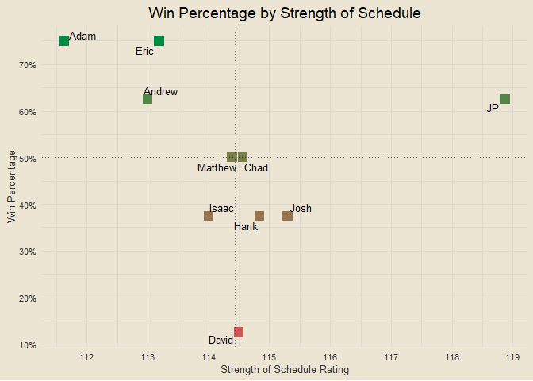
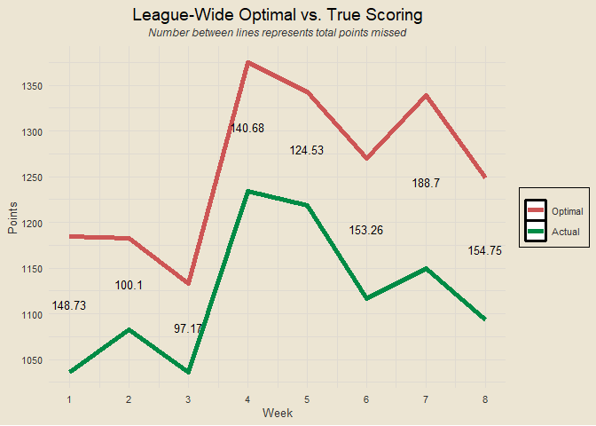

Travis Scott Burger Fantasy League 2025
================

*All data from
<a href="https://ffscrapr.ffverse.com/" target="_blank">ffscrapr</a> R
library*

------------------------------------------------------------------------

### Contents

- [Team Standings](#team-standings)
- [Points Scored per Game](#points-scored-per-game)
- [Points Against per Game](#points-against-per-game)
- [Points Scored and Against](#points-scored-and-against)
- [Optimal Lineup Setting](#optimal-lineup-setting)
- [Season Long Optimal Lineups](#season-long-optimal-lineups)
- [Most Points Scored in a Loss](#most-points-scored-in-a-loss)
- [Fewest Points Scored in a
  Victory](#fewest-points-scored-in-a-victory)
- [Weekly Scoring Trends](#weekly-scoring-trends)
- [Close Games](#close-games)
- [Highest Scoring Games](#highest-scoring-games)
- [Biggest Blowouts](#biggest-blowouts)
- [Closest Games](#closest-games)
- [Most Points Scored by One Team](#most-points-scored-by-one-team)
- [Fewest Points Scored by One Team](#fewest-points-scored-by-one-team)
- [Past Week One Player Merchants](#past-week-one-player-merchants)
- [Full Season One Player Merchants](#full-season-one-player-merchants)
- [Luckiest Teams This Past Week](#luckiest-teams-this-past-week)
- [Luckiest Teams Season Long](#luckiest-teams-season-long)
- [Self Luck and Opponent Luck](#self-luck-and-opponent-luck)
- [Average Weekly Finishing
  Position](#average-weekly-finishing-position)
- [Chug Analysis](#chug-analysis)
- [Win Percentage by Strength of
  Schedule](#win-percentage-by-strength-of-schedule)
- [League Wide Optimal Scoring](#league-wide-optimal-scoring)
- [Top Three Scoring](#top-three-scoring)
- [Bottom Three Scoring](#bottom-three-scoring)
- [Average Scoring in Wins](#average-scoring-in-wins)
- [Projected Records](#projected-records)
- [Wins When Projected to Lose](#wins-when-projected-to-lose)

------------------------------------------------------------------------

### Team Standings

<!-- -->

------------------------------------------------------------------------

### Points Scored per Game

<!-- -->

------------------------------------------------------------------------

### Points Against per Game

<!-- -->

------------------------------------------------------------------------

### Points Scored and Against

<!-- -->

------------------------------------------------------------------------

### Optimal Lineup Setting

<!-- -->

------------------------------------------------------------------------

### Season Long Optimal Lineups

<!-- -->

------------------------------------------------------------------------

### Most Points Scored in a Loss

- Week 9: Josh def. Jeremiah 132.51-132.24
- Week 11: David def. Matthew 159.65-129.89
- Week 11: Eric def. Andrew 143.68-123.87
- Week 3: JP def. Adam 136.12-122.98
- Week 8: Chad def. JP 136.84-122.03

------------------------------------------------------------------------

### Fewest Points Scored in a Victory

- Week 4: Adam def. Eric 72.44-70.28
- Week 10: David def. Jeremiah 89.81-73.07
- Week 8: Andrew def. Matthew 90.23-82.87
- Week 1: Eric def. Andrew 91.4-68.57
- Week 7: Chad def. Eric 91.6-62.28

------------------------------------------------------------------------

### Weekly Scoring Trends

<!-- -->

------------------------------------------------------------------------

### Close Games

<!-- -->

------------------------------------------------------------------------

### Highest Scoring Games

- Week 11: David def. Matthew 159.65-129.89
- Week 4: JP def. Andrew 162.54-118.23
- Week 5: Adam def. David 165.1-111.25
- Week 11: Eric def. Andrew 143.68-123.87
- Week 9: Josh def. Jeremiah 132.51-132.24

------------------------------------------------------------------------

### Biggest Blowouts

- Week 10: Adam def. Eric 146.44-81.23
- Week 5: Hank def. Andrew 143.83-80.98
- Week 6: Chad def. Andrew 137.75-76.64
- Week 2: Josh def. Eric 137.81-82.82
- Week 5: Adam def. David 165.1-111.25

------------------------------------------------------------------------

### Closest Games

- Week 3: Eric def. Hank 98.13-98.11
- Week 9: Josh def. Jeremiah 132.51-132.24
- Week 9: JP def. Andrew 108.65-108.25
- Week 9: Eric def. Matthew 98.07-96.36
- Week 4: Adam def. Eric 72.44-70.28

------------------------------------------------------------------------

### Most Points Scored by One Team

- 165.1 (Adam, Week 5)
- 162.54 (JP, Week 4)
- 159.65 (David, Week 11)
- 148.92 (Jeremiah, Week 7)
- 148.33 (Adam, Week 9)

------------------------------------------------------------------------

### Fewest Points Scored by One Team

- 62.28 (Eric, Week 7)
- 62.4 (Eric, Week 6)
- 68.57 (Andrew, Week 1)
- 70.28 (Eric, Week 4)
- 72.44 (Adam, Week 4)

------------------------------------------------------------------------

### Past Week One Player Merchants

- Saquon Barkley: 33.6% of total points for Jeremiah
- Jared Goff: 25.9% of total points for Josh
- Amon-Ra St. Brown: 25.6% of total points for Matthew
- Matthew Stafford: 25.5% of total points for Jeremiah
- Joe Mixon: 21.5% of total points for David

------------------------------------------------------------------------

### Full Season One Player Merchants

- Lamar Jackson: 17.66% of total points for Adam
- Saquon Barkley: 16.63% of total points for Jeremiah
- Derrick Henry: 16.53% of total points for JP
- Ja’Marr Chase: 16.09% of total points for JP
- James Cook: 15.66% of total points for Eric

------------------------------------------------------------------------

### Luckiest Teams This Past Week

<!-- -->

------------------------------------------------------------------------

### Luckiest Teams Season Long

<!-- -->

------------------------------------------------------------------------

### Self Luck and Opponent Luck

<!-- -->

------------------------------------------------------------------------

### Average Weekly Finishing Position

<!-- -->

For example: if Hank had the best score in the league, the third best
score in the league, and the second best score in the league through
three weeks, his average weekly finishing position would be (1 + 3 + 2)
/ 3 = 2. Closely related to points per game, but not the exact same.

------------------------------------------------------------------------

### Chug Analysis

<!-- -->

------------------------------------------------------------------------

### Win Percentage by Strength of Schedule

<!-- -->

Strength of schedule is calculated as the average projected score of
your opponents. So if JP were to play three opponents with projected
scores of 100, 110, and 120, his SOS rating would be (100 + 110 + 120) /
3 = 110.

------------------------------------------------------------------------

### League Wide Optimal Scoring

<!-- -->

------------------------------------------------------------------------

### Top Three Scoring

<!-- -->

------------------------------------------------------------------------

### Bottom Three Scoring

<!-- -->

------------------------------------------------------------------------

### Average Scoring in Wins

<!-- -->

------------------------------------------------------------------------

### Projected Records

<!-- -->

------------------------------------------------------------------------

### Wins When Projected to Lose

- Eric: 3 wins when projected to lose
- Matthew: 3 wins when projected to lose
- Andrew: 2 wins when projected to lose
- David: 2 wins when projected to lose
- Hank: 2 wins when projected to lose
- Jeremiah: 2 wins when projected to lose
- Chad: 1 win when projected to lose
- JP: 1 win when projected to lose
- Josh: 1 win when projected to lose
- Adam: 0 wins when projected to lose

------------------------------------------------------------------------
