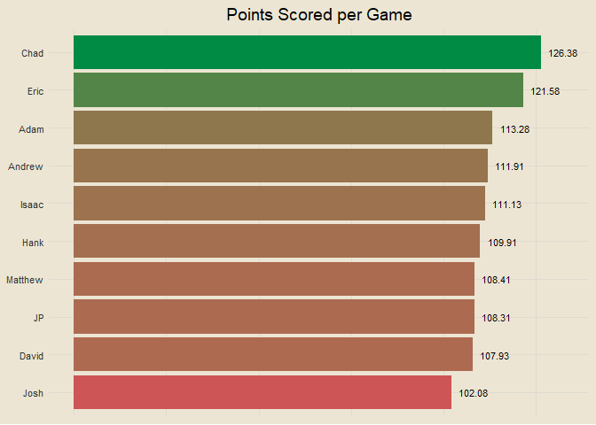
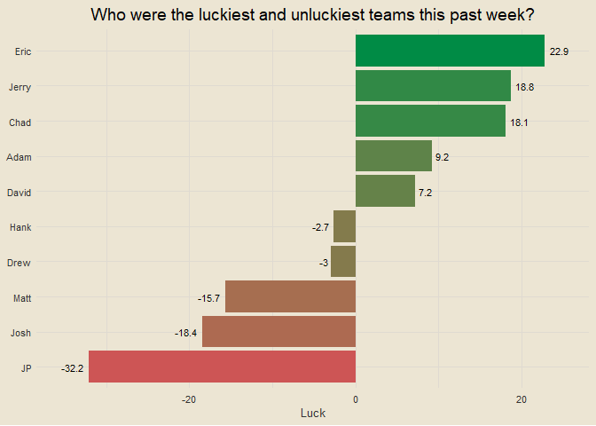

Travis Scott Burger Fantasy League 2025
================

### Contents

- [Team Standings](#team-standings)
- [Points Scored Per Game](#points-scored-per-game)
- [Points Against Per Game](#points-against-per-game)
- [Scatterplot of Points Scored and
  Against](#scatterplot-of-points-scored-and-against)
- [Optimal Lineup Setting](#optimal-lineup-setting)
- [Season-Long Optimal Lineups](#season-long-optimal-lineups)
- [Most Points Scored in a Loss](#most-points-scored-in-a-loss)
- [Fewest Points Scored in a
  Victory](#fewest-points-scored-in-a-victory)
- [Weekly Scoring Trends](#weekly-scoring-trends)
- [Close Games](#close-games)
- [Highest Scoring Games](#highest-scoring-games)
- [Biggest Blowouts](#biggest-blowouts)
- [Closest Games](#closest-games)
- [Most Points Scored by One Team](#most-points-scored-by-one-team)
- [Fewest Points Scored by One Team](#fewest-points-scored-by-one-team)
- [Past Week One Player Merchants](#past-week-one-player-merchants)
- [Luckiest Teams This Past Week](#luckiest-teams-this-past-week)
- [Luckiest Teams Season Long](#luckiest-teams-season-long)

------------------------------------------------------------------------

### Team Standings

<!-- -->

------------------------------------------------------------------------

### Points Scored Per Game

<!-- -->

------------------------------------------------------------------------

### Points Against Per Game

<!-- -->

------------------------------------------------------------------------

### Scatterplot of Points Scored and Against

<!-- -->

------------------------------------------------------------------------

### Optimal Lineup Setting

<!-- -->

------------------------------------------------------------------------

### Season-Long Optimal Lineups

<!-- -->

------------------------------------------------------------------------

### Most Points Scored in a Loss

- Week 1: CeeDee Lamb’s Finsta def. cArOLinA pAntHErS 135.88-115.53
- Week 2: Bearly Alive def. DSM-5 All Stars 127.85-115.24
- Week 2: Shock Squad def. CeeDee Lamb’s Finsta 115.37-107.13
- Week 1: Stroud Nine def. Bearly Alive 116.99-106.47
- Week 2: Super Lamario def. Orthopedics PreOp 116.85-95.68

------------------------------------------------------------------------

### Fewest Points Scored in a Victory

- Week 1: Dakshots def. Orthopedics PreOp 91.4-68.57
- Week 1: He’s Litewally Gwiddying def. Super Lamario 97.74-88.21
- Week 2: Shock Squad def. CeeDee Lamb’s Finsta 115.37-107.13
- Week 2: Super Lamario def. Orthopedics PreOp 116.85-95.68
- Week 1: Stroud Nine def. Bearly Alive 116.99-106.47

------------------------------------------------------------------------

### Weekly Scoring Trends

*Coming next week …*

------------------------------------------------------------------------

### Close Games

<!-- -->

------------------------------------------------------------------------

### Highest Scoring Games

- Week 1: CeeDee Lamb’s Finsta def. cArOLinA pAntHErS 135.88 to 115.53
- Week 2: Bearly Alive def. DSM-5 All Stars 127.85 to 115.24
- Week 1: Stroud Nine def. Bearly Alive 116.99 to 106.47
- Week 2: Shock Squad def. CeeDee Lamb’s Finsta 115.37 to 107.13
- Week 2: cArOLinA pAntHErS def. Dakshots 137.81 to 82.82

------------------------------------------------------------------------

### Biggest Blowouts

- Week 2: cArOLinA pAntHErS def. Dakshots 137.81 to 82.82
- Week 1: DSM-5 All Stars def. Shock Squad 122.99 to 91.13
- Week 2: He’s Litewally Gwiddying def. Stroud Nine 120.53 to 94.48
- Week 1: Dakshots def. Orthopedics PreOp 91.4 to 68.57
- Week 2: Super Lamario def. Orthopedics PreOp 116.85 to 95.68

------------------------------------------------------------------------

### Closest Games

- Week 2: Shock Squad def. CeeDee Lamb’s Finsta 115.37 to 107.13
- Week 1: He’s Litewally Gwiddying def. Super Lamario 97.74 to 88.21
- Week 1: Stroud Nine def. Bearly Alive 116.99 to 106.47
- Week 2: Bearly Alive def. DSM-5 All Stars 127.85 to 115.24
- Week 1: CeeDee Lamb’s Finsta def. cArOLinA pAntHErS 135.88 to 115.53

------------------------------------------------------------------------

### Most Points Scored by One Team

- 137.81 (cArOLinA pAntHErS, Week 2)
- 135.88 (CeeDee Lamb’s Finsta, Week 1)
- 127.85 (Bearly Alive, Week 2)
- 122.99 (DSM-5 All Stars, Week 1)
- 120.53 (He’s Litewally Gwiddying, Week 2)

------------------------------------------------------------------------

### Fewest Points Scored by One Team

- 68.57 (Orthopedics PreOp, Week 1)
- 82.82 (Dakshots, Week 2)
- 88.21 (Super Lamario, Week 1)
- 91.13 (Shock Squad, Week 1)
- 91.4 (Dakshots, Week 1)

------------------------------------------------------------------------

### Past Week One Player Merchants

- Cooper Kupp: 36.5% of total points for Orthopedics PreOp
- James Cook: 33.8% of total points for Dakshots
- Alvin Kamara: 31.2% of total points for cArOLinA pAntHErS
- Lamar Jackson: 25.4% of total points for Super Lamario
- Tyreek Hill: 24.6% of total points for Dakshots

------------------------------------------------------------------------

### Luckiest Teams This Past Week

<!-- -->

------------------------------------------------------------------------

### Luckiest Teams Season Long

<!-- -->

------------------------------------------------------------------------

### Chug Analysis

<!-- -->

------------------------------------------------------------------------
