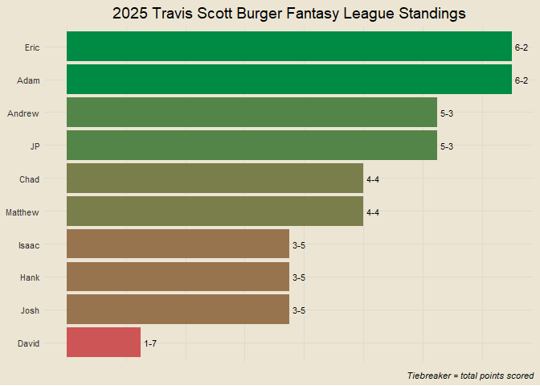
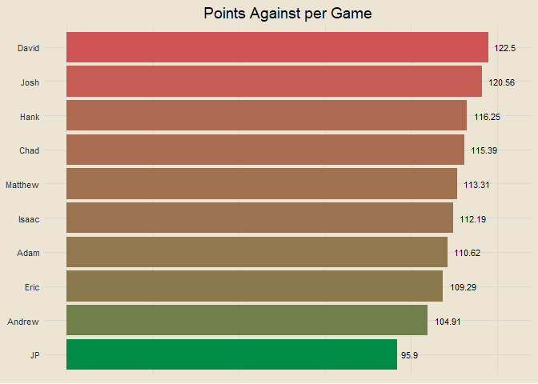
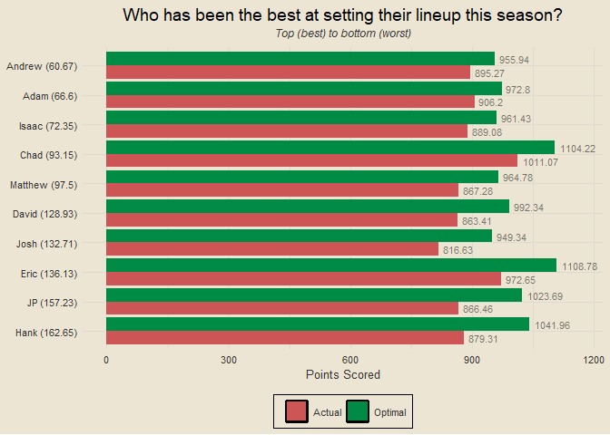
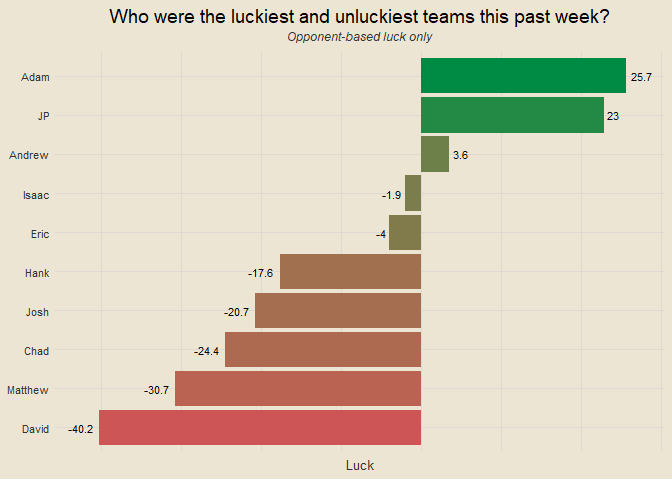

Travis Scott Burger Fantasy League 2025
================

### Contents

- [Team Standings](#team-standings)
- [Points Scored Per Game](#points-scored-per-game)
- [Points Against Per Game](#points-against-per-game)
- [Scatterplot of Points Scored and
  Against](#scatterplot-of-points-scored-and-against)
- [Optimal Lineup Setting](#optimal-lineup-setting)
- [Season-Long Optimal Lineups](#season-long-optimal-lineups)
- [Most Points Scored in a Loss](#most-points-scored-in-a-loss)
- [Fewest Points Scored in a
  Victory](#fewest-points-scored-in-a-victory)
- [Weekly Scoring Trends](#weekly-scoring-trends)
- [Close Games](#close-games)
- [Highest Scoring Games](#highest-scoring-games)
- [Biggest Blowouts](#biggest-blowouts)
- [Closest Games](#closest-games)
- [Most Points Scored by One Team](#most-points-scored-by-one-team)
- [Fewest Points Scored by One Team](#fewest-points-scored-by-one-team)
- [Past Week One Player Merchants](#past-week-one-player-merchants)
- [Full Season One Player Merchants](#full-season-one-player-merchants)
- [Luckiest Teams This Past Week](#luckiest-teams-this-past-week)
- [Luckiest Teams Season Long](#luckiest-teams-season-long)
- [Past Week Full Luck](#past-week-full-luck)
- [Season Long Full Luck](#season-long-full-luck)
- [Average Weekly Finishing
  Position](#average-weekly-finishing-position)
- [Chug Analysis](#chug-analysis)

------------------------------------------------------------------------

### Team Standings

<!-- -->

------------------------------------------------------------------------

### Points Scored Per Game

<!-- -->

------------------------------------------------------------------------

### Points Against Per Game

<!-- -->

------------------------------------------------------------------------

### Scatterplot of Points Scored and Against

<!-- -->

------------------------------------------------------------------------

### Optimal Lineup Setting

<!-- -->

------------------------------------------------------------------------

### Season-Long Optimal Lineups

<!-- -->

------------------------------------------------------------------------

### Most Points Scored in a Loss

- Week 3: JP def. Adam 136.12-122.98
- Week 8: Chad def. JP 136.84-122.03
- Week 8: Jerry def. Adam 131.87-121.79
- Week 6: David def. Hank 143.83-120.26
- Week 4: JP def. Drew 162.54-118.23

------------------------------------------------------------------------

### Fewest Points Scored in a Victory

- Week 4: Adam def. Eric 72.44-70.28
- Week 8: Drew def. Matt 90.23-82.87
- Week 1: Eric def. Drew 91.4-68.57
- Week 7: Chad def. Eric 91.6-62.88
- Week 6: Jerry def. Eric 97.64-62.4

------------------------------------------------------------------------

### Weekly Scoring Trends

<!-- -->

------------------------------------------------------------------------

### Close Games

<!-- -->

------------------------------------------------------------------------

### Highest Scoring Games

- Week 4: JP def. Drew 162.54 to 118.23
- Week 5: Adam def. David 165.1 to 111.25
- Week 6: David def. Hank 143.83 to 120.26
- Week 3: JP def. Adam 136.12 to 122.98
- Week 8: Chad def. JP 136.84 to 122.03

------------------------------------------------------------------------

### Biggest Blowouts

- Week 5: Hank def. Drew 143.83 to 80.98
- Week 6: Chad def. Drew 137.75 to 76.64
- Week 2: Josh def. Eric 137.81 to 82.82
- Week 5: Adam def. David 165.1 to 111.25
- Week 6: Adam def. Matt 142.83 to 91.58

------------------------------------------------------------------------

### Closest Games

- Week 3: Eric def. Hank 98.13 to 98.11
- Week 4: Adam def. Eric 72.44 to 70.28
- Week 3: Drew def. Jerry 103.08 to 99.47
- Week 3: Matt def. David 97.73 to 93.26
- Week 4: Chad def. Hank 107.04 to 102.47

------------------------------------------------------------------------

### Most Points Scored by One Team

- 165.1 (Adam, Week 5)
- 162.54 (JP, Week 4)
- 148.92 (Jerry, Week 7)
- 147.4 (Hank, Week 8)
- 143.83 (David, Week 6)

------------------------------------------------------------------------

### Fewest Points Scored by One Team

- 62.4 (Eric, Week 6)
- 62.88 (Eric, Week 7)
- 68.57 (Drew, Week 1)
- 70.28 (Eric, Week 4)
- 72.44 (Adam, Week 4)

------------------------------------------------------------------------

### Past Week One Player Merchants

- De’Von Achane: 26.3% of total points for Drew
- CeeDee Lamb: 25.1% of total points for Jerry
- James Cook: 24.5% of total points for Eric
- Kyler Murray: 23.1% of total points for Matt
- Jalen Hurts: 22.2% of total points for Hank

------------------------------------------------------------------------

### Full Season One Player Merchants

1.  Lamar Jackson: 18.67% of total points for Adam
2.  Baker Mayfield: 17.13% of total points for Jerry
3.  Derrick Henry: 16.99% of total points for JP
4.  James Cook: 16.98% of total points for Eric
5.  Kyler Murray: 15.26% of total points for Matt
6.  Josh Allen: 15.07% of total points for Chad
7.  Kyren Williams: 14.68% of total points for Josh
8.  Alvin Kamara: 14.48% of total points for Josh
9.  Jayden Daniels: 14.34% of total points for JP
10. Saquon Barkley: 14.3% of total points for Jerry

------------------------------------------------------------------------

### Luckiest Teams This Past Week

<!-- -->

------------------------------------------------------------------------

### Luckiest Teams Season Long

<!-- -->

------------------------------------------------------------------------

### Past Week Full Luck

<!-- -->

------------------------------------------------------------------------

### Season Long Full Luck

<!-- -->

------------------------------------------------------------------------

### Average Weekly Finishing Position

<!-- -->

For example: if Hank had the best score in the league, the third best
score in the league, and the second best score in the league through
three weeks, his average weekly finishing position would be (1 + 3 + 2)
/ 3 = 2. Closely related to points per game, but not the exact same.

------------------------------------------------------------------------

### Chug Analysis

<!-- -->
