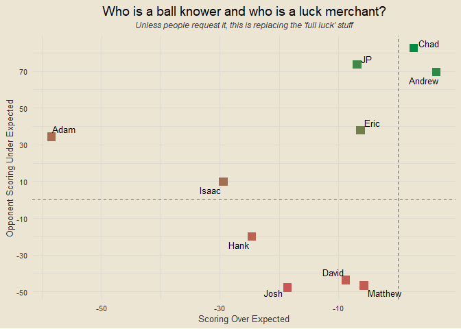

Travis Scott Burger Fantasy League 2025
================

### Contents

- [Team Standings](#team-standings)
- [Points Scored Per Game](#points-scored-per-game)
- [Points Against Per Game](#points-against-per-game)
- [Scatterplot of Points Scored and
  Against](#scatterplot-of-points-scored-and-against)
- [Optimal Lineup Setting](#optimal-lineup-setting)
- [Season-Long Optimal Lineups](#season-long-optimal-lineups)
- [Most Points Scored in a Loss](#most-points-scored-in-a-loss)
- [Fewest Points Scored in a
  Victory](#fewest-points-scored-in-a-victory)
- [Weekly Scoring Trends](#weekly-scoring-trends)
- [Close Games](#close-games)
- [Highest Scoring Games](#highest-scoring-games)
- [Biggest Blowouts](#biggest-blowouts)
- [Closest Games](#closest-games)
- [Most Points Scored by One Team](#most-points-scored-by-one-team)
- [Fewest Points Scored by One Team](#fewest-points-scored-by-one-team)
- [Past Week One Player Merchants](#past-week-one-player-merchants)
- [Luckiest Teams This Past Week](#luckiest-teams-this-past-week)
- [Luckiest Teams Season Long](#luckiest-teams-season-long)
- [Past Week Full Luck](#past-week-full-luck)
- [Season Long Full Luck](#season-long-full-luck)
- [Chug Analysis](#chug-analysis)

------------------------------------------------------------------------

### Team Standings

<!-- -->

------------------------------------------------------------------------

### Points Scored Per Game

<!-- -->

------------------------------------------------------------------------

### Points Against Per Game

<!-- -->

------------------------------------------------------------------------

### Scatterplot of Points Scored and Against

<!-- -->

------------------------------------------------------------------------

### Optimal Lineup Setting

<!-- -->

------------------------------------------------------------------------

### Season-Long Optimal Lineups

<!-- -->

------------------------------------------------------------------------

### Most Points Scored in a Loss

- Week 3: Stroud Nine def. Crashee Rice 136.12-122.98
- Week 6: Shock Squad def. Love Hurts 143.83-120.26
- Week 4: Stroud Nine def. Orthopedics PreOp 162.54-118.23
- Week 4: Bearly Alive def. CeeDee Lamb’s Finsta 125.14-117.69
- Week 1: CeeDee Lamb’s Finsta def. cArOLinA pAntHErS 135.88-115.53

------------------------------------------------------------------------

### Fewest Points Scored in a Victory

- Week 4: Crashee Rice def. Dakshots 72.44-70.28
- Week 1: Dakshots def. Orthopedics PreOp 91.4-68.57
- Week 6: CeeDee Lamb’s Finsta def. Dakshots 97.64-62.4
- Week 3: Bearly Alive def. Shock Squad 97.73-93.26
- Week 1: Love Hurts def. Crashee Rice 97.74-88.21

------------------------------------------------------------------------

### Weekly Scoring Trends

<!-- -->

------------------------------------------------------------------------

### Close Games

<!-- -->

------------------------------------------------------------------------

### Highest Scoring Games

- Week 4: Stroud Nine def. Orthopedics PreOp 162.54 to 118.23
- Week 5: Crashee Rice def. Shock Squad 165.1 to 111.25
- Week 6: Shock Squad def. Love Hurts 143.83 to 120.26
- Week 3: Stroud Nine def. Crashee Rice 136.12 to 122.98
- Week 1: CeeDee Lamb’s Finsta def. cArOLinA pAntHErS 135.88 to 115.53

------------------------------------------------------------------------

### Biggest Blowouts

- Week 5: Love Hurts def. Orthopedics PreOp 143.83 to 80.98
- Week 6: DSM-5 All Stars def. Orthopedics PreOp 137.75 to 76.64
- Week 2: cArOLinA pAntHErS def. Dakshots 137.81 to 82.82
- Week 5: Crashee Rice def. Shock Squad 165.1 to 111.25
- Week 6: Crashee Rice def. Bearly Alive 142.83 to 91.58

------------------------------------------------------------------------

### Closest Games

- Week 3: Dakshots def. Love Hurts 98.13 to 98.11
- Week 4: Crashee Rice def. Dakshots 72.44 to 70.28
- Week 3: Orthopedics PreOp def. CeeDee Lamb’s Finsta 103.08 to 99.47
- Week 3: Bearly Alive def. Shock Squad 97.73 to 93.26
- Week 4: DSM-5 All Stars def. Love Hurts 107.04 to 102.47

------------------------------------------------------------------------

### Most Points Scored by One Team

- 165.1 (Crashee Rice, Week 5)
- 162.54 (Stroud Nine, Week 4)
- 143.83 (Love Hurts, Week 5)
- 143.83 (Shock Squad, Week 6)
- 142.83 (Crashee Rice, Week 6)

------------------------------------------------------------------------

### Fewest Points Scored by One Team

- 62.4 (Dakshots, Week 6)
- 68.57 (Orthopedics PreOp, Week 1)
- 70.28 (Dakshots, Week 4)
- 72.44 (Crashee Rice, Week 4)
- 73.57 (cArOLinA pAntHErS, Week 5)

------------------------------------------------------------------------

### Past Week One Player Merchants

- Chris Boswell: 27.2% of total points for Dakshots
- Jared Goff: 23.4% of total points for cArOLinA pAntHErS
- Baker Mayfield: 23.2% of total points for CeeDee Lamb’s Finsta
- Brock Bowers: 22.2% of total points for Dakshots
- George Kittle: 22.1% of total points for CeeDee Lamb’s Finsta

------------------------------------------------------------------------

### Luckiest Teams This Past Week

<!-- -->

------------------------------------------------------------------------

### Luckiest Teams Season Long

<!-- -->

------------------------------------------------------------------------

### Past Week Full Luck

<!-- -->

------------------------------------------------------------------------

### Season Long Full Luck

<!-- -->

------------------------------------------------------------------------

### Chug Analysis

<!-- -->
