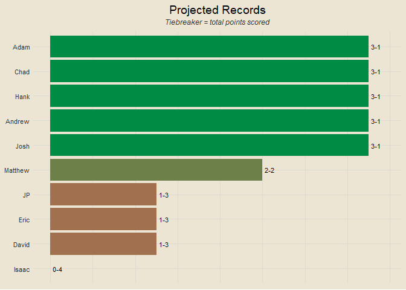
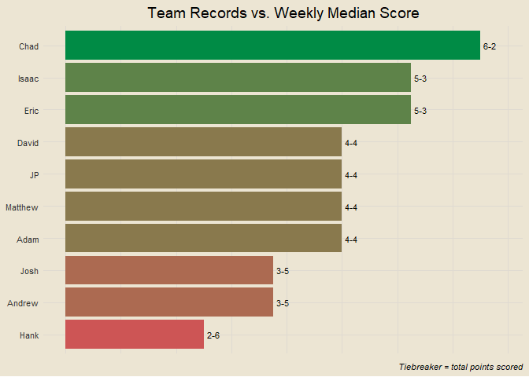
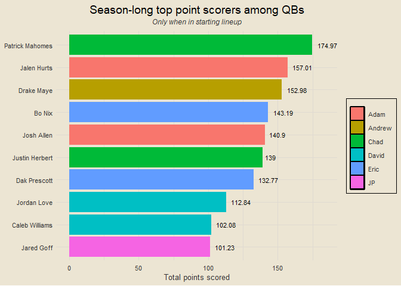
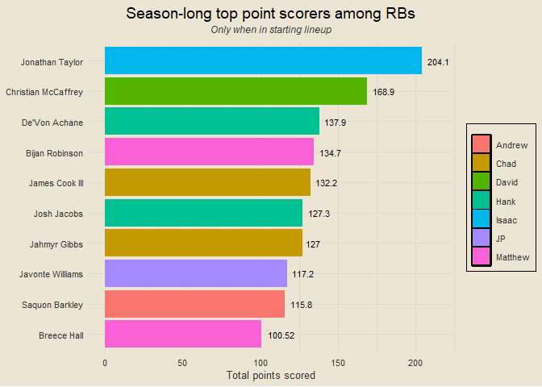
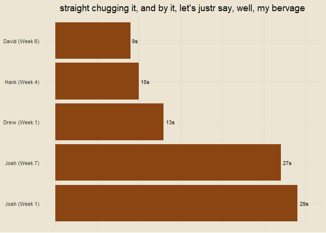

Travis Scott Burger Fantasy League 2025
================

### Contents

- [Team Standings](#team-standings)
- [Points Scored Per Game](#points-scored-per-game)
- [Points Against Per Game](#points-against-per-game)
- [Scatterplot of Points Scored and
  Against](#scatterplot-of-points-scored-and-against)
- [Optimal Lineup Setting](#optimal-lineup-setting)
- [Season-Long Optimal Lineups](#season-long-optimal-lineups)
- [Most Points Scored in a Loss](#most-points-scored-in-a-loss)
- [Fewest Points Scored in a
  Victory](#fewest-points-scored-in-a-victory)
- [Weekly Scoring Trends](#weekly-scoring-trends)
- [Close Games](#close-games)
- [Highest Scoring Games](#highest-scoring-games)
- [Biggest Blowouts](#biggest-blowouts)
- [Closest Games](#closest-games)
- [Most Points Scored by One Team](#most-points-scored-by-one-team)
- [Fewest Points Scored by One Team](#fewest-points-scored-by-one-team)
- [Past Week One Player Merchants](#past-week-one-player-merchants)
- [Full Season One Player Merchants](#full-season-one-player-merchants)
- [Luckiest Teams This Past Week](#luckiest-teams-this-past-week)
- [Luckiest Teams Season Long](#luckiest-teams-season-long)
- [Past Week Full Luck](#past-week-full-luck)
- [Season Long Full Luck](#season-long-full-luck)
- [Average Weekly Finishing
  Position](#average-weekly-finishing-position)
- [Chug Analysis](#chug-analysis)

------------------------------------------------------------------------

### Team Standings

<!-- -->

------------------------------------------------------------------------

### Points Scored Per Game

<!-- -->

------------------------------------------------------------------------

### Points Against Per Game

<!-- -->

------------------------------------------------------------------------

### Scatterplot of Points Scored and Against

<!-- -->

------------------------------------------------------------------------

### Optimal Lineup Setting

<!-- -->

------------------------------------------------------------------------

### Season-Long Optimal Lineups

<!-- -->

------------------------------------------------------------------------

### Most Points Scored in a Loss

- Week 3: JP def. Adam 136.12-122.98
- Week 8: Chad def. JP 136.84-122.03
- Week 8: Jerry def. Adam 131.87-121.79
- Week 6: David def. Hank 143.83-120.26
- Week 4: JP def. Drew 162.54-118.23

------------------------------------------------------------------------

### Fewest Points Scored in a Victory

- Week 4: Adam def. Eric 72.44-70.28
- Week 8: Drew def. Matt 90.23-82.87
- Week 1: Eric def. Drew 91.4-68.57
- Week 7: Chad def. Eric 91.6-62.88
- Week 6: Jerry def. Eric 97.64-62.4

------------------------------------------------------------------------

### Weekly Scoring Trends

<!-- -->

------------------------------------------------------------------------

### Close Games

<!-- -->

------------------------------------------------------------------------

### Highest Scoring Games

- Week 4: JP def. Drew 162.54 to 118.23
- Week 5: Adam def. David 165.1 to 111.25
- Week 6: David def. Hank 143.83 to 120.26
- Week 3: JP def. Adam 136.12 to 122.98
- Week 8: Chad def. JP 136.84 to 122.03

------------------------------------------------------------------------

### Biggest Blowouts

- Week 5: Hank def. Drew 143.83 to 80.98
- Week 6: Chad def. Drew 137.75 to 76.64
- Week 2: Josh def. Eric 137.81 to 82.82
- Week 5: Adam def. David 165.1 to 111.25
- Week 6: Adam def. Matt 142.83 to 91.58

------------------------------------------------------------------------

### Closest Games

- Week 3: Eric def. Hank 98.13 to 98.11
- Week 4: Adam def. Eric 72.44 to 70.28
- Week 3: Drew def. Jerry 103.08 to 99.47
- Week 3: Matt def. David 97.73 to 93.26
- Week 4: Chad def. Hank 107.04 to 102.47

------------------------------------------------------------------------

### Most Points Scored by One Team

- 165.1 (Adam, Week 5)
- 162.54 (JP, Week 4)
- 148.92 (Jerry, Week 7)
- 147.4 (Hank, Week 8)
- 143.83 (David, Week 6)

------------------------------------------------------------------------

### Fewest Points Scored by One Team

- 62.4 (Eric, Week 6)
- 62.88 (Eric, Week 7)
- 68.57 (Drew, Week 1)
- 70.28 (Eric, Week 4)
- 72.44 (Adam, Week 4)

------------------------------------------------------------------------

### Past Week One Player Merchants

- De’Von Achane: 26.3% of total points for Drew
- CeeDee Lamb: 25.1% of total points for Jerry
- James Cook: 24.5% of total points for Eric
- Kyler Murray: 23.1% of total points for Matt
- Jalen Hurts: 22.2% of total points for Hank

------------------------------------------------------------------------

### Full Season One Player Merchants

1.  Lamar Jackson: 18.67% of total points for Adam
2.  Baker Mayfield: 17.13% of total points for Jerry
3.  Derrick Henry: 16.99% of total points for JP
4.  James Cook: 16.98% of total points for Eric
5.  Kyler Murray: 15.26% of total points for Matt
6.  Josh Allen: 15.07% of total points for Chad
7.  Kyren Williams: 14.68% of total points for Josh
8.  Alvin Kamara: 14.48% of total points for Josh
9.  Jayden Daniels: 14.34% of total points for JP
10. Saquon Barkley: 14.3% of total points for Jerry

------------------------------------------------------------------------

### Luckiest Teams This Past Week

<!-- -->

------------------------------------------------------------------------

### Luckiest Teams Season Long

<!-- -->

------------------------------------------------------------------------

### Past Week Full Luck

<!-- -->

------------------------------------------------------------------------

### Season Long Full Luck

<!-- -->

------------------------------------------------------------------------

### Average Weekly Finishing Position

<!-- -->

For example: if Hank had the best score in the league, the third best
score in the league, and the second best score in the league through
three weeks, his average weekly finishing position would be (1 + 3 + 2)
/ 3 = 2. Closely related to points per game, but not the exact same.

------------------------------------------------------------------------

### Chug Analysis

<!-- -->

# EVERYTHING FROM THIS POINT FORWARD IS A WORK IN PROGRESS

``` r
library(tidyverse)
library(tvthemes)
library(ffscrapr)
library(ggimage)
library(glue)

theme_custom = theme_avatar() +
  theme(plot.title = element_text(hjust = 0.5),
        plot.subtitle = element_text(hjust = 0.5, size = 9, vjust = 2.5, face = "italic"),
        plot.caption = element_text(face = "italic"),
        panel.grid.major = element_line(linewidth = 0.5, colour = "#DFDAD1"),
        panel.grid.minor = element_line(linewidth = 0.5, colour = "#DFDAD1"))

theme_set(theme_custom)

conn = ff_connect(platform = "espn", league_id = "81518506", season = 2024)

id_to_name = ff_rosters(conn = conn) |>
  distinct(franchise_id, franchise_name)

team_name_to_name = ff_franchises(conn) |>
  separate(user_name, into = c("first", "last"), sep = " ", remove = T) |>
  select(franchise_name, first)

end_games = ff_schedule(conn, week = 1:14) |>
  filter(franchise_score > 0 & opponent_score > 0) |>
  inner_join(id_to_name, by = "franchise_id") |>
  inner_join(id_to_name, by = c("opponent_id" = "franchise_id")) |>
  rename(franchise_name = franchise_name.x, opponent_name = franchise_name.y) |>
  filter(result == "W") |>
  select(week,
         win_team = franchise_name, win_score = franchise_score,
         lose_score = opponent_score, lose_team = opponent_name)

get_team_total_pts_scored = function(tm) {
  w = end_games |> filter(win_team == tm) |> pull(win_score)
  l = end_games |> filter(lose_team == tm) |> pull(lose_score)
  return(sum(c(w, l)))
}

get_team_total_pts_against = function(tm) {
  w = end_games |> filter(win_team == tm) |> pull(lose_score)
  l = end_games |> filter(lose_team == tm) |> pull(win_score)
  return(sum(c(w, l)))
}

team_records = end_games |>
  count(win_team) |>
  setNames(c("team", "wins")) |>
  full_join(end_games |>
  count(lose_team) |>
  setNames(c("team", "losses")), by = "team") |>
  mutate(wins = coalesce(wins, 0),
         losses = coalesce(losses, 0),
         gp = wins + losses,
         win_pct = round(wins / gp * 100, 2),
         record = paste0(wins, "-", losses)) |>
  inner_join(team_name_to_name, by = c("team" = "franchise_name")) |>
  mutate(pts_scored = sapply(team, get_team_total_pts_scored),
         pts_against = sapply(team, get_team_total_pts_against)) |>
  arrange(desc(win_pct), desc(pts_scored))

standings_vec = team_records$first

all_teams = sort(unique(c(end_games$win_team, end_games$lose_team)))
```

### Team Standings v2

``` r
team_records |>
  mutate(first = factor(first, levels = rev(standings_vec))) |>
  ggplot(aes(first, win_pct)) +
  geom_col(aes(fill = win_pct), show.legend = F) +
  coord_flip() +
  scale_fill_gradient(low = "indianred3", high = "springgreen4") +
  geom_text(aes(label = record), size = 3, hjust = -0.25) +
  labs(x = NULL, y = NULL,
       title = "2024 Travis Scott Burger Fantasy League Standings",
       caption = "Tiebreaker = total points scored") +
  theme(axis.text.x = element_blank())
```

<!-- -->

### Points Scored per Game v2

``` r
ymax = max(team_records$pts_scored) / max(end_games$week)

team_records |>
  mutate(ppg = pts_scored / gp) |>
  ggplot(aes(reorder(first, ppg), ppg)) +
  geom_col(aes(fill = ppg), show.legend = F) +
  coord_flip(ylim = c(0, ymax * 1.05)) +
  scale_fill_gradient(low = "indianred3", high = "springgreen4") +
  geom_text(aes(label = round(ppg, 2)), size = 3, hjust = -0.25) +
  labs(x = NULL, y = NULL,
       title = "Points Scored per Game") +
  theme(axis.text.x = element_blank())
```

<!-- -->

### Points Against per Game v2

``` r
ymax = max(team_records$pts_against) / max(end_games$week)

team_records |>
  mutate(papg = pts_against / gp) |>
  ggplot(aes(reorder(first, papg), papg)) +
  geom_col(aes(fill = papg), show.legend = F) +
  coord_flip(ylim = c(0, ymax * 1.05)) +
  scale_fill_gradient(low = "springgreen4", high = "indianred3") +
  geom_text(aes(label = round(papg, 2)), size = 3, hjust = -0.25) +
  labs(x = NULL, y = NULL,
       title = "Points Against per Game") +
  theme(axis.text.x = element_blank())
```

<!-- -->

### Points Scored and Against v2

``` r
team_ppg_papg = team_records |>
  transmute(ppg = pts_scored / gp, papg = pts_against / gp)

team_records |>
  transmute(first, ppg = pts_scored / gp, papg = pts_against / gp, diff = ppg - papg) |>
  ggplot(aes(ppg, papg)) +
  geom_point(aes(col = diff), shape = "square", size = 4, show.legend = F) +
  scale_color_gradient(low = "indianred3", high = "springgreen4") +
  geom_vline(xintercept = mean(team_ppg_papg$ppg), linetype = "dashed", alpha = 0.5) +
  geom_hline(yintercept = mean(team_ppg_papg$papg), linetype = "dashed", alpha = 0.5) +
  ggrepel::geom_text_repel(aes(label = first), size = 3.5, max.overlaps = 10) +
  labs(x = "Points Scored per Game", y = "Points Against per Game",
       title = "Team points for vs. points against per game",
       subtitle = "Dashed lines represent league averages") +
  scale_x_continuous(breaks = seq(0, 200, by = 5)) +
  scale_y_continuous(breaks = seq(0, 200, by = 2.5))
```

<!-- -->

### optimal lineup setting v2

``` r
true_optimal_pts_weekly = espn_potentialpoints(conn, weeks = 1:max(end_games$week)) |>
  distinct(week, franchise_name, franchise_score) |>
  inner_join(espn_potentialpoints(conn, weeks = 1:max(end_games$week)) |>
  filter(!is.na(optimal_slot)) |>
  group_by(week, franchise_name) |>
  summarise(opt = sum(player_score),
            .groups = "drop"), by = c("week", "franchise_name")) |>
  setNames(c("week", "franchise_name", "true_score", "opt_score")) |>
  mutate(missed = round(opt_score - true_score, 2))

vis_data = true_optimal_pts_weekly |>
  filter(week == max(end_games$week)) |>
  inner_join(team_name_to_name, by = "franchise_name") |>
  arrange(missed) |>
  transmute(name = paste0(first, " (", missed, ")"),
            true_score, opt_score)

name_order = vis_data$name

vis_data |>
  mutate(name = factor(name, levels = rev(name_order))) |>
  pivot_longer(!name, names_to = "which", values_to = "pts") |>
  mutate(which = ifelse(which == "opt_score", "Optimal", "Actual")) |>
  ggplot(aes(name, pts)) +
  geom_col(aes(fill = which), position = "dodge") +
  geom_text(aes(label = pts), size = 3, hjust = -0.15, alpha = 0.5,
            position = position_dodge2(width = 0.9)) +
  coord_flip(ylim = c(0, max(vis_data$opt_score) * 1.05)) +
  labs(x = NULL, y = "Points Scored", fill = NULL,
       title = "Who sucked at setting their lineup this past week?",
       subtitle = "Top (best) to bottom (worst)") +
  scale_fill_manual(values = c("indianred3", "springgreen4")) +
  scale_y_continuous(breaks = seq(0, 250, by = 10))
```

<!-- -->

### season long optimal lineups v2

``` r
vis_data = true_optimal_pts_weekly |>
  inner_join(team_name_to_name, by = "franchise_name") |>
  group_by(franchise_name) |>
  summarise(true_score = sum(true_score),
            opt_score = sum(opt_score),
            missed = sum(missed)) |>
  inner_join(team_name_to_name, by = "franchise_name") |>
  arrange(missed) |>
  transmute(name = paste0(first, " (", missed, ")"),
            true_score, opt_score)

name_order = vis_data$name

vis_data |>
  mutate(name = factor(name, levels = rev(name_order))) |>
  pivot_longer(!name, names_to = "which", values_to = "pts") |>
  mutate(which = ifelse(which == "opt_score", "Optimal", "Actual")) |>
  ggplot(aes(name, pts)) +
  geom_col(aes(fill = which), position = "dodge") +
  geom_text(aes(label = pts), size = 3, hjust = -0.15, alpha = 0.5,
            position = position_dodge2(width = 0.9)) +
  coord_flip(ylim = c(0, max(vis_data$opt_score) * 1.05)) +
  labs(x = NULL, y = "Points Scored", fill = NULL,
       title = "Who has been the best at setting their lineup this season?",
       subtitle = "Top (best) to bottom (worst)") +
  scale_fill_manual(values = c("indianred3", "springgreen4"))
```

<!-- -->

### most pts scored in a loss v2

``` r
x = end_games |>
  slice_max(lose_score, n = 5, with_ties = F) |>
  inner_join(team_name_to_name, by = c("win_team" = "franchise_name")) |>
  rename(win_name = first) |>
  inner_join(team_name_to_name, by = c("lose_team" = "franchise_name")) |>
  rename(lose_name = first) |>
  mutate(score = paste0(win_score, "-", lose_score)) |>
  mutate(x = as.character(glue("Week {week}: {win_name} def. {lose_name} {score}"))) |>
  pull(x)
```

- Week 3: JP def. Adam 136.12-122.98
- Week 8: Chad def. JP 136.84-122.03
- Week 8: Jeremiah def. Adam 131.87-121.79
- Week 6: David def. Hank 143.83-120.26
- Week 4: JP def. Andrew 162.54-118.23

### fewest pts scored in a victory v2

``` r
x = end_games |>
  slice_min(win_score, n = 5, with_ties = F) |>
  inner_join(team_name_to_name, by = c("win_team" = "franchise_name")) |>
  rename(win_name = first) |>
  inner_join(team_name_to_name, by = c("lose_team" = "franchise_name")) |>
  rename(lose_name = first) |>
  mutate(score = paste0(win_score, "-", lose_score)) |>
  mutate(x = as.character(glue("Week {week}: {win_name} def. {lose_name} {score}"))) |>
  pull(x)
```

- Week 4: Adam def. Eric 72.44-70.28
- Week 8: Andrew def. Matthew 90.23-82.87
- Week 1: Eric def. Andrew 91.4-68.57
- Week 7: Chad def. Eric 91.6-62.28
- Week 6: Jeremiah def. Eric 97.64-62.4

### weekly scoring trends

``` r
end_games |>
  select(week, team = win_team, score = win_score) |>
  rbind(end_games |>
  select(week, team = lose_team, score = lose_score)) |>
  group_by(team) |>
  mutate(pct = score / sum(score)) |>
  ungroup() |>
  inner_join(team_records |>
  distinct(team, pts_scored), by = "team") |>
  inner_join(team_name_to_name, by = c("team" = "franchise_name")) |>
  mutate(first = paste0(first, "\n(", pts_scored, ")")) |>
  ggplot(aes(week, pct)) +
  geom_line(aes(col = pts_scored), linewidth = 1.5, show.legend = F) +
  scale_color_gradient(low = "indianred3", high = "springgreen4") +
  facet_wrap(vars(first)) +
  theme(axis.text = element_blank()) +
  labs(x = "Week", y = "Percent of Total Points Scored",
       title = "Weekly Scoring Trends",
       subtitle = "Line color indicates total points scored")
```

<!-- -->

### close games

``` r
end_with_margins = end_games |>
  mutate(margin = win_score - lose_score)

get_team_avg_margin = function(tm) {
  x = end_with_margins |> filter(win_team == tm | lose_team == tm) |> pull(margin)
  return(round(mean(x), 2))
}

team_avg_margins = data.frame(team = all_teams) |>
  mutate(avg_margin = sapply(team, get_team_avg_margin)) |>
  inner_join(team_name_to_name, by = c("team" = "franchise_name"))

team_avg_margins |>
  ggplot(aes(reorder(first, -avg_margin), avg_margin)) +
  geom_col(aes(fill = avg_margin), show.legend = F) +
  coord_flip(ylim = c(0, max(team_avg_margins$avg_margin) * 1.05)) +
  scale_fill_gradient(low = "indianred3", high = "springgreen4") +
  geom_text(aes(label = avg_margin), size = 3, hjust = -0.25) +
  labs(x = NULL, y = "Average game margin",
       title = "Who is playing the closest games, on average?",
       subtitle = "Without regard to winning or losing") +
  scale_y_continuous(breaks = seq(0, 50, by = 5))
```

<!-- -->

### Highest Scoring Games v2

``` r
x = end_games |>
  mutate(total = win_score + lose_score,
         final = paste0(win_score, "-", lose_score)) |>
  slice_max(total, n = 5, with_ties = F) |>
  inner_join(team_name_to_name, by = c("win_team" = "franchise_name")) |>
  rename(win_first = first) |>
  inner_join(team_name_to_name, by = c("lose_team" = "franchise_name")) |>
  rename(lose_first = first) |>
  mutate(x = as.character(glue("Week {week}: {win_first} def. {lose_first} {final}"))) |>
  pull(x)
```

- Week 4: JP def. Andrew 162.54-118.23
- Week 5: Adam def. David 165.1-111.25
- Week 6: David def. Hank 143.83-120.26
- Week 3: JP def. Adam 136.12-122.98
- Week 8: Chad def. JP 136.84-122.03

### Biggest blowouts v2

``` r
x = end_games |>
  mutate(score = paste0(win_score, "-", lose_score),
         diff = win_score - lose_score) |>
  slice_max(diff, n = 5, with_ties = F) |>
  mutate(x = as.character(glue("Week {week}: {win_team} def. {lose_team} {score}"))) |>
  pull(x)
```

- Week 5: Love Hurts def. Orthopedics PreOp 143.83-80.98
- Week 6: DSM-5 All Stars def. Orthopedics PreOp 137.75-76.64
- Week 2: cArOLinA pAntHErS def. Dakshots 137.81-82.82
- Week 5: Hank’s Ass def. Shock Squad 165.1-111.25
- Week 6: Hank’s Ass def. Bearly Alive 142.83-91.58

### closest games v2

``` r
x = end_games |>
  mutate(score = paste0(win_score, "-", lose_score),
         diff = win_score - lose_score) |>
  slice_min(diff, n = 5, with_ties = F) |>
  mutate(x = as.character(glue("Week {week}: {win_team} def. {lose_team} {score}"))) |>
  pull(x)
```

- Week 3: Dakshots def. Love Hurts 98.13-98.11
- Week 4: Hank’s Ass def. Dakshots 72.44-70.28
- Week 3: Orthopedics PreOp def. Tua’s Brain Scan 103.08-99.47
- Week 3: Bearly Alive def. Shock Squad 97.73-93.26
- Week 4: DSM-5 All Stars def. Love Hurts 107.04-102.47

### most points scored by one team v2

``` r
x = end_games |>
  select(week, team = win_team, score = win_score) |>
  rbind(end_games |>
  select(week, team = lose_team, score = lose_score)) |>
  slice_max(score, n = 5, with_ties = F) |>
  inner_join(team_name_to_name, by = c("team" = "franchise_name")) |>
  mutate(x = as.character(glue("{score} ({first}, Week {week})"))) |>
  pull(x)
```

- 165.1 (Adam, Week 5)
- 162.54 (JP, Week 4)
- 148.92 (Jeremiah, Week 7)
- 147.4 (Hank, Week 8)
- 143.83 (Hank, Week 5)

### fewest points scored by one team v2

``` r
x = end_games |>
  select(week, team = win_team, score = win_score) |>
  rbind(end_games |>
  select(week, team = lose_team, score = lose_score)) |>
  slice_min(score, n = 5, with_ties = F) |>
  inner_join(team_name_to_name, by = c("team" = "franchise_name")) |>
  mutate(x = as.character(glue("{score} ({first}, Week {week})"))) |>
  pull(x)
```

- 62.28 (Eric, Week 7)
- 62.4 (Eric, Week 6)
- 68.57 (Andrew, Week 1)
- 70.28 (Eric, Week 4)
- 72.44 (Adam, Week 4)

### past week one player merchants v2

``` r
x = ff_starters(conn, week = max(end_games$week)) |>
  filter(!lineup_slot %in% c("BE", "IR")) |>
  mutate(pct = round(player_score / franchise_score * 100, 1)) |>
  slice_max(pct, n = 5, with_ties = F) |>
  inner_join(team_name_to_name, by = "franchise_name") |>
  mutate(x = as.character(glue("{player_name}: {pct}% of total points for {first}"))) |>
  pull(x)
```

- De’Von Achane: 26.3% of total points for Andrew
- CeeDee Lamb: 25.1% of total points for Jeremiah
- James Cook: 24.5% of total points for Eric
- Kyler Murray: 23.1% of total points for Matthew
- Jalen Hurts: 22.2% of total points for Hank

### full season one player merchants

``` r
x = ff_starters(conn, week = 1:max(end_games$week)) |>
  filter(!lineup_slot %in% c("BE", "IR")) |>
  group_by(franchise_name, player_name) |>
  summarise(pts = sum(player_score),
            .groups = "drop") |>
  inner_join(team_records |>
  select(team, first, pts_scored), by = c("franchise_name" = "team")) |>
  mutate(pct = round(pts / pts_scored * 100, 2)) |>
  slice_max(pct, n = 10, with_ties = F) |>
  mutate(x = as.character(glue("{player_name}: {pct}% of total points for {first}"))) |>
  pull(x)
```

- Lamar Jackson: 18.67% of total points for Adam
- Baker Mayfield: 17.13% of total points for Jeremiah
- Derrick Henry: 16.99% of total points for JP
- James Cook: 16.98% of total points for Eric
- Kyler Murray: 15.26% of total points for Matthew

### luckiest teams this past week

``` r
true_proj_scores_weekly = ff_starters(conn, week = 1:max(end_games$week)) |>
  filter(!lineup_slot %in% c("BE", "IR")) |>
  group_by(week, franchise_name) |>
  summarise(true_score = mean(franchise_score),
            proj_score = round(sum(projected_score), 2),
            .groups = "drop")

end_with_proj = end_games |>
  inner_join(true_proj_scores_weekly, by = c("win_team" = "franchise_name", "week")) |>
  rename(win_proj_score = proj_score) |>
  inner_join(true_proj_scores_weekly, by = c("lose_team" = "franchise_name", "week")) |>
  rename(lose_proj_score = proj_score) |>
  select(!contains("true")) |>
  mutate(win_score_over_proj = win_score - win_proj_score,
         lose_score_over_proj = lose_score - lose_proj_score)

past_week_luck_data = end_with_proj |>
  filter(week == max(end_games$week)) |>
  transmute(team = win_team, luck = lose_score_over_proj * -1) |>
  rbind(end_with_proj |>
  filter(week == max(end_games$week)) |>
  transmute(team = lose_team, luck = win_score_over_proj * -1)) |>
  inner_join(team_name_to_name, by = c("team" = "franchise_name")) |>
  mutate(poslab = ifelse(luck >= 0, round(luck, 1), ""),
         neglab = ifelse(luck < 0, round(luck, 1), ""))

past_week_luck_data |>
  ggplot(aes(reorder(first, luck), luck)) +
  geom_col(aes(fill = luck), show.legend = F) +
  coord_flip(ylim = c(min(past_week_luck_data$luck) * 1.05,
                      max(past_week_luck_data$luck) * 1.05)) +
  scale_fill_gradient(low = "indianred3", high = "springgreen4") +
  geom_text(aes(label = poslab), size = 3, hjust = -0.25) +
  geom_text(aes(label = neglab), size = 3, hjust = 1.25) +
  labs(x = NULL, y = "Luck",
       title = "Who were the luckiest and unluckiest teams this past week?",
       subtitle = "Opponent-based luck only") +
  theme(axis.text.x = element_blank())
```

<!-- -->

### luckiest teams season-long

``` r
full_szn_luck = end_with_proj |>
  transmute(team = win_team, luck = lose_score_over_proj * -1) |>
  rbind(end_with_proj |>
  transmute(team = lose_team, luck = win_score_over_proj * -1)) |>
  inner_join(team_name_to_name, by = c("team" = "franchise_name")) |>
  group_by(team, first) |>
  summarise(luck = sum(luck),
            .groups = "drop") |>
  mutate(poslab = ifelse(luck >= 0, round(luck, 1), ""),
         neglab = ifelse(luck < 0, round(luck, 1), ""))

full_szn_luck |>
  ggplot(aes(reorder(first, luck), luck)) +
  geom_col(aes(fill = luck), show.legend = F) +
  coord_flip(ylim = c(min(full_szn_luck$luck) * 1.05,
                      max(full_szn_luck$luck) * 1.05)) +
  scale_fill_gradient(low = "indianred3", high = "springgreen4") +
  geom_text(aes(label = poslab), size = 3, hjust = -0.25) +
  geom_text(aes(label = neglab), size = 3, hjust = 1.25) +
  labs(x = NULL, y = "Luck",
       title = "Who are the luckiest and unluckiest teams season-long?",
       subtitle = "Opponent-based luck only") +
  theme(axis.text.x = element_blank())
```

<!-- -->

### self luck and opponent luck

``` r
get_team_score_over_proj = function(tm) {
  w = end_with_proj |> filter(win_team == tm) |> pull(win_score_over_proj)
  l = end_with_proj |> filter(lose_team == tm) |> pull(lose_score_over_proj)
  return(sum(c(w, l)))
}

get_team_opp_score_over_proj = function(tm) {
  w = end_with_proj |> filter(win_team == tm) |> pull(lose_score_over_proj)
  l = end_with_proj |> filter(lose_team == tm) |> pull(win_score_over_proj)
  return(sum(c(w, l ) * -1))
}

data.frame(team = all_teams) |>
  mutate(sop = sapply(team, get_team_score_over_proj),
         luck = sapply(team, get_team_opp_score_over_proj),
         total = sop + luck) |>
  inner_join(team_name_to_name, by = c("team" = "franchise_name")) |>
  ggplot(aes(sop, luck)) +
  geom_point(aes(col = total), shape = "square", size = 4, show.legend = F) +
  ggrepel::geom_text_repel(aes(label = first), size = 3.5, max.overlaps = 10) +
  scale_color_gradient(low = "indianred3", high = "springgreen4") +
  geom_vline(xintercept = 0, linetype = "dashed", alpha = 0.5) +
  geom_hline(yintercept = 0, linetype = "dashed", alpha = 0.5) +
  labs(x = "Scoring Over Expected",
       y = "Opponent Scoring Under Expected",
       title = "Who is a ball knower and who is a luck merchant?",
       subtitle = "Unless people request it, this is replacing the 'full luck' stuff") +
  scale_x_continuous(breaks = seq(-250, 250, by = 20)) +
  scale_y_continuous(breaks = seq(-250, 250, by = 20))
```

<!-- -->

### average weekly finishing position

``` r
pos_data = select(end_games, week, team = win_team, score = win_score) |>
  rbind(select(end_games, week, team = lose_team, score = lose_score)) |>
  group_by(week) |>
  mutate(pos = rank(-score)) |>
  ungroup() |>
  group_by(team) |>
  summarise(avg_pos = round(mean(pos), 2)) |>
  inner_join(team_name_to_name, by = c("team" = "franchise_name"))

pos_data |>
  ggplot(aes(reorder(first, -avg_pos), avg_pos)) +
  geom_col(aes(fill = avg_pos), show.legend = F) +
  scale_fill_gradient(high = "indianred3", low = "springgreen4") +
  coord_flip(ylim = c(0, max(pos_data$avg_pos) * 1.05)) +
  geom_text(aes(label = avg_pos), size = 3, hjust = -0.25) +
  labs(x = NULL, y = "Average weekly finishing position",
       title = "Average weekly finishing position by team") +
  scale_y_continuous(breaks = seq(0, 10, by = 1))
```

<!-- -->

For example: if Hank had the best score in the league, the third best
score in the league, and the second best score in the league through
three weeks, his average weekly finishing position would be (1 + 3 + 2)
/ 3 = 2. Closely related to points per game, but not the exact same.

### chug analysis v2

``` r
names = c("Josh", "Drew", "Hank", "David", "Josh")
weeks = c(1, 1, 4, 6, 7)
times = c(29, 13, 10, 9, 27)

data.frame(name = names, week = weeks, time = times) |>
  mutate(lab = paste0(name, " (Week ", week, ")"),
         timelab = paste0(time, "s")) |>
  ggplot(aes(reorder(lab, -time), time)) +
  geom_col(fill = "saddlebrown") +
  coord_flip(ylim = c(0, max(times) * 1.05)) +
  geom_text(aes(label = timelab), size = 3, hjust = -0.25) +
  labs(x = NULL, y = NULL,
       title = "straight chugging it, and by it, let's justr say, well, my bervage") +
  theme(axis.text.x = element_blank())
```

<!-- -->

### work in progress, win pct by sos

``` r
get_opp_proj_scores = function(tm) {
  w = end_with_proj |> filter(win_team == tm) |> pull(lose_proj_score)
  l = end_with_proj |> filter(lose_team == tm) |> pull(win_proj_score)
  return(round(mean(c(w, l)), 2))
}

data.frame(team = all_teams) |>
  mutate(sos = sapply(team, get_opp_proj_scores)) |>
  inner_join(team_records, by = "team") |>
  ggplot(aes(sos, win_pct)) +
  geom_text(aes(label = first), size = 4) +
  geom_line(stat = "smooth", formula = y ~ x, method = "lm", linetype = "dashed")
```

<!-- -->
