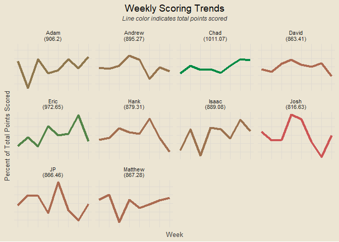
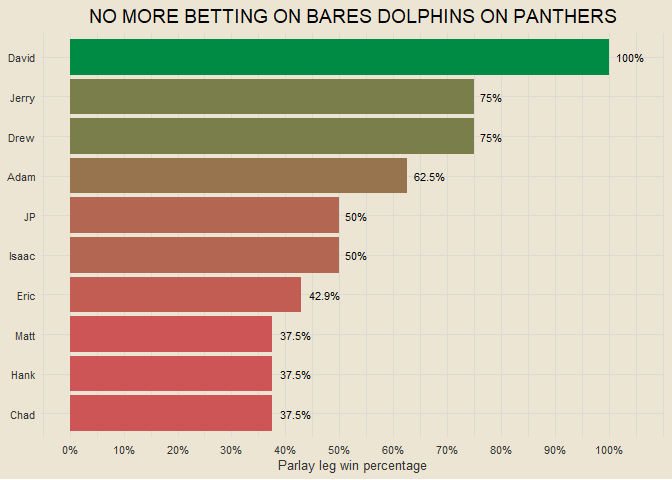
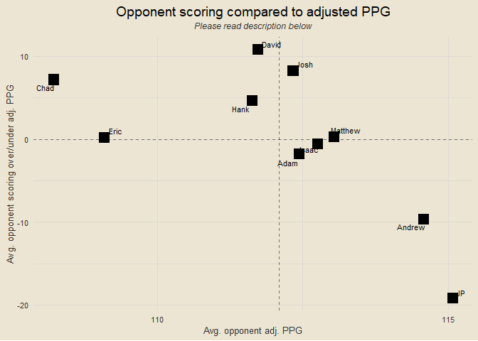
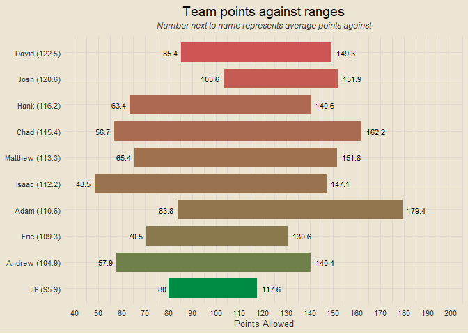

Travis Scott Burger Fantasy League 2025
================

*All data from
<a href="https://ffscrapr.ffverse.com/" target="_blank">ffscrapr</a> R
library*

------------------------------------------------------------------------

### Contents

- [Team Standings](#team-standings)
- [Points Scored per Game](#points-scored-per-game)
- [Points Against per Game](#points-against-per-game)
- [Points Scored and Against](#points-scored-and-against)
- [Optimal Lineup Setting](#optimal-lineup-setting)
- [Season Long Optimal Lineups](#season-long-optimal-lineups)
- [Most Points Scored in a Loss](#most-points-scored-in-a-loss)
- [Fewest Points Scored in a
  Victory](#fewest-points-scored-in-a-victory)
- [Weekly Scoring Trends](#weekly-scoring-trends)
- [Close Games](#close-games)
- [Highest Scoring Games](#highest-scoring-games)
- [Biggest Blowouts](#biggest-blowouts)
- [Closest Games](#closest-games)
- [Most Points Scored by One Team](#most-points-scored-by-one-team)
- [Fewest Points Scored by One Team](#fewest-points-scored-by-one-team)
- [Past Week One Player Merchants](#past-week-one-player-merchants)
- [Full Season One Player Merchants](#full-season-one-player-merchants)
- [Luckiest Teams This Past Week](#luckiest-teams-this-past-week)
- [Luckiest Teams Season Long](#luckiest-teams-season-long)
- [Self Luck and Opponent Luck](#self-luck-and-opponent-luck)
- [Average Weekly Finishing
  Position](#average-weekly-finishing-position)
- [Chug Analysis](#chug-analysis)
- [Win Percentage by Strength of
  Schedule](#win-percentage-by-strength-of-schedule)
- [League Wide Optimal Scoring](#league-wide-optimal-scoring)
- [Top Three Scoring](#top-three-scoring)
- [Bottom Three Scoring](#bottom-three-scoring)
- [Average Scoring in Wins](#average-scoring-in-wins)
- [Projected Records](#projected-records)
- [Wins When Projected to Lose](#wins-when-projected-to-lose)
- [Team Records vs League Median](#team-records-vs-league-median)
- [Supreme Luck Merchant](#supreme-luck-merchant)
- [Parlay Tracking](#parlay-tracking)
- [Opponent Adjusted PPG](#opponent-adjusted-ppg)
- [Opponent Scoring Compared to Adjusted
  PPG](#opponent-scoring-compared-to-adjusted-ppg)
- [Team Scoring Ranges](#team-scoring-ranges)
- [Team Points Against Ranges](#team-points-against-ranges)

------------------------------------------------------------------------

### Team Standings

<!-- -->

------------------------------------------------------------------------

### Points Scored per Game

<!-- -->

------------------------------------------------------------------------

### Points Against per Game

<!-- -->

------------------------------------------------------------------------

### Points Scored and Against

<!-- -->

------------------------------------------------------------------------

### Optimal Lineup Setting

<!-- -->

------------------------------------------------------------------------

### Season Long Optimal Lineups

<!-- -->

------------------------------------------------------------------------

### Most Points Scored in a Loss

- Week 4: Eric def. David 147.5-126.72
- Week 2: Matthew def. Isaac 130.85-126.71
- Week 4: Andrew def. Chad 142.01-119.84
- Week 4: Isaac def. Hank 131.22-117.83
- Week 4: Josh def. Matthew 151.77-117.17

------------------------------------------------------------------------

### Fewest Points Scored in a Victory

- Week 1: Eric def. Isaac 90.32-70.53
- Week 4: Adam def. JP 96.47-85.75
- Week 2: Andrew def. David 107.14-95.02
- Week 1: Andrew def. Hank 109.32-97.3
- Week 1: Josh def. Chad 109.88-107.08

------------------------------------------------------------------------

### Weekly Scoring Trends

<!-- Coming next week -->

<!-- -->

------------------------------------------------------------------------

### Close Games

<!-- -->

------------------------------------------------------------------------

### Highest Scoring Games

- Week 4: Eric def. David 147.5-126.72
- Week 4: Josh def. Matthew 151.77-117.17
- Week 4: Andrew def. Chad 142.01-119.84
- Week 2: Matthew def. Isaac 130.85-126.71
- Week 4: Isaac def. Hank 131.22-117.83

------------------------------------------------------------------------

### Biggest Blowouts

- Week 2: Chad def. Adam 130.57-56.67
- Week 3: Chad def. Matthew 118.57-60.76
- Week 3: Andrew def. Isaac 114.52-57.86
- Week 3: Adam def. Josh 134.37-90.02
- Week 2: JP def. Josh 129.07-88.75

------------------------------------------------------------------------

### Closest Games

- Week 1: Josh def. Chad 109.88-107.08
- Week 2: Matthew def. Isaac 130.85-126.71
- Week 3: Hank def. David 127.23-116.63
- Week 4: Adam def. JP 96.47-85.75
- Week 1: Andrew def. Hank 109.32-97.3

------------------------------------------------------------------------

### Most Points Scored by One Team

- 151.77 (Josh, Week 4)
- 147.5 (Eric, Week 4)
- 142.01 (Andrew, Week 4)
- 134.37 (Adam, Week 3)
- 131.22 (Isaac, Week 4)

------------------------------------------------------------------------

### Fewest Points Scored by One Team

- 56.67 (Adam, Week 2)
- 57.86 (Isaac, Week 3)
- 60.76 (Matthew, Week 3)
- 70.53 (Isaac, Week 1)
- 85.75 (JP, Week 4)

------------------------------------------------------------------------

### Past Week One Player Merchants

- Josh Jacobs: 25.2% of total points for Hank
- Ashton Jeanty: 24.8% of total points for Isaac
- Josh Allen: 23.6% of total points for Adam
- Bijan Robinson: 22.3% of total points for Matthew
- Emeka Egbuka: 21.1% of total points for JP

------------------------------------------------------------------------

### Full Season One Player Merchants

- Jonathan Taylor: 21.54% of total points for Isaac
- Josh Allen: 21.31% of total points for Adam
- Lamar Jackson: 19.05% of total points for JP
- Jalen Hurts: 18.76% of total points for Adam
- Puka Nacua: 18.71% of total points for Andrew

------------------------------------------------------------------------

### Luckiest Teams This Past Week

<!-- -->

------------------------------------------------------------------------

### Luckiest Teams Season Long

<!-- -->

------------------------------------------------------------------------

### Self Luck and Opponent Luck

<!-- -->

------------------------------------------------------------------------

### Average Weekly Finishing Position

<!-- -->

For example: if Hank had the best score in the league, the third best
score in the league, and the second best score in the league through
three weeks, his average weekly finishing position would be (1 + 3 + 2)
/ 3 = 2. Closely related to points per game, but not the exact same.

------------------------------------------------------------------------

### Chug Analysis

Where literally anyone chug?

------------------------------------------------------------------------

### Win Percentage by Strength of Schedule

<!-- -->

Strength of schedule is calculated as the average projected score of
your opponents. So if JP were to play three opponents with projected
scores of 100, 110, and 120, his SOS rating would be (100 + 110 + 120) /
3 = 110.

------------------------------------------------------------------------

### League Wide Optimal Scoring

<!-- Coming next week -->

<!-- -->

------------------------------------------------------------------------

### Top Three Scoring

<!-- -->

------------------------------------------------------------------------

### Bottom Three Scoring

<!-- -->

------------------------------------------------------------------------

### Average Scoring in Wins

<!-- -->

------------------------------------------------------------------------

### Projected Records

<!-- -->

------------------------------------------------------------------------

### Wins When Projected to Lose

- Eric: 2 wins when projected to lose
- Andrew: 1 win when projected to lose
- Isaac: 1 win when projected to lose
- JP: 1 win when projected to lose
- Adam: 0 wins when projected to lose
- Chad: 0 wins when projected to lose
- David: 0 wins when projected to lose
- Hank: 0 wins when projected to lose
- Josh: 0 wins when projected to lose
- Matthew: 0 wins when projected to lose

------------------------------------------------------------------------

### Team Records vs League Median

<!-- -->

------------------------------------------------------------------------

### Supreme Luck Merchant

<!-- -->

**Label numbers explained**: To calculate these overall values, I
normalized both everyone’s strength of schedule ratings and their luck
ratings so that they are on the same scale. Note that my calculation
assumes these two are equal, i.e. strength of schedule and opponent
scoring under average play an equal role in determining someone’s “luck”
as we’re loosely defining it. Once I have these two normalized numbers,
I subtract the normalized SOS score from the normalized luck score
because a lower SOS is “luckier” so to speak. This then determines the
overall number you see in parentheses next to everyone’s names.

------------------------------------------------------------------------

### Parlay Tracking

<!-- -->

------------------------------------------------------------------------

### Opponent Adjusted PPG

Description under the plot after this one

<!-- -->

------------------------------------------------------------------------

### Opponent Scoring Compared to Adjusted PPG

<!-- -->

This one is a work in progress and another pseudo-attempt at
visualizing/quantifying strength of schedule. The motivation behind it
is to get average opponent PPG in games where they are not playing you.
For example, suppose I am playing Hank. His “adjusted PPG” would be his
PPG in games he has played against everyone else but me. So if Hank
scored 100 against me, 110 against David, 120 against JP, 80 against
Adam, and 95 against Josh, his “adjusted PPG” would be (110 + 120 + 80 +
95) / 4 = 101.25. If you wanted to, you could go a step further with
this and say that given that number, Hank scoring 100 against me would
be him under performing by 1.25 points compared to his “adjusted PPG” of
101.25. That is how the y-axis is calculated. *If you made it this far
and are reading this, I love you.* I haven’t yet messed with flipping
axes, so for now, further right would indicate tougher competition, on
average, and higher would indicate your opponent scoring higher than
“expected” given their adjusted PPG.

------------------------------------------------------------------------

### Team Scoring Ranges

<!-- -->

------------------------------------------------------------------------

### Team Points Against Ranges

<!-- -->

------------------------------------------------------------------------
