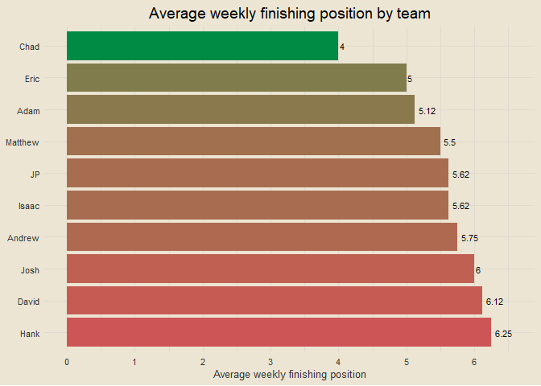

Travis Scott Burger Fantasy League 2026
================

*All data from
<a href="https://ffscrapr.ffverse.com/" target="_blank">ffscrapr</a> R
library*

------------------------------------------------------------------------

### Contents

- [Team Standings](#team-standings)
- [Points Scored per Game](#points-scored-per-game)
- [Points Against per Game](#points-against-per-game)
- [Points Scored and Against](#points-scored-and-against)
- [Optimal Lineup Setting](#optimal-lineup-setting)
- [Season Long Optimal Lineups](#season-long-optimal-lineups)
- [Most Points Scored in a Loss](#most-points-scored-in-a-loss)
- [Fewest Points Scored in a
  Victory](#fewest-points-scored-in-a-victory)
- [Weekly Scoring Trends](#weekly-scoring-trends)
- [Close Games](#close-games)
- [Highest Scoring Games](#highest-scoring-games)
- [Biggest Blowouts](#biggest-blowouts)
- [Closest Games](#closest-games)
- [Most Points Scored by One Team](#most-points-scored-by-one-team)
- [Fewest Points Scored by One Team](#fewest-points-scored-by-one-team)
- [Past Week One Player Merchants](#past-week-one-player-merchants)
- [Full Season One Player Merchants](#full-season-one-player-merchants)
- [Luckiest Teams This Past Week](#luckiest-teams-this-past-week)
- [Luckiest Teams Season Long](#luckiest-teams-season-long)
- [Self Luck and Opponent Luck](#self-luck-and-opponent-luck)
- [Average Weekly Finishing
  Position](#average-weekly-finishing-position)
- [Chug Analysis](#chug-analysis)
- [Win Percentage by Strength of
  Schedule](#win-percentage-by-strength-of-schedule)
- [League Wide Optimal Scoring](#league-wide-optimal-scoring)
- [Top Three Scoring](#top-three-scoring)
- [Bottom Three Scoring](#bottom-three-scoring)
- [Average Scoring in Wins](#average-scoring-in-wins)
- [Projected Records](#projected-records)
- [Wins When Projected to Lose](#wins-when-projected-to-lose)
- [Team Records vs League Median](#team-records-vs-league-median)
- [Supreme Luck Merchant](#supreme-luck-merchant)
- [Parlay Tracking](#parlay-tracking)

------------------------------------------------------------------------

### Team Standings

<!-- -->

------------------------------------------------------------------------

### Points Scored per Game

<!-- -->

------------------------------------------------------------------------

### Points Against per Game

<!-- -->

------------------------------------------------------------------------

### Points Scored and Against

<!-- -->

------------------------------------------------------------------------

### Optimal Lineup Setting

<!-- -->

------------------------------------------------------------------------

### Season Long Optimal Lineups

<!-- -->

------------------------------------------------------------------------

### Most Points Scored in a Loss

- Week 1: Josh def. Chad 109.88-107.08
- Week 1: Matthew def. JP 117.63-102.72
- Week 1: Adam def. David 129.28-101.59
- Week 1: Andrew def. Hank 109.32-97.3
- Week 1: Eric def. Isaac 90.32-70.53

------------------------------------------------------------------------

### Fewest Points Scored in a Victory

- Week 1: Eric def. Isaac 90.32-70.53
- Week 1: Andrew def. Hank 109.32-97.3
- Week 1: Josh def. Chad 109.88-107.08
- Week 1: Matthew def. JP 117.63-102.72
- Week 1: Adam def. David 129.28-101.59

------------------------------------------------------------------------

### Weekly Scoring Trends

Coming next week

------------------------------------------------------------------------

### Close Games

<!-- -->

------------------------------------------------------------------------

### Highest Scoring Games

- Week 1: Adam def. David 129.28-101.59
- Week 1: Matthew def. JP 117.63-102.72
- Week 1: Josh def. Chad 109.88-107.08
- Week 1: Andrew def. Hank 109.32-97.3
- Week 1: Eric def. Isaac 90.32-70.53

------------------------------------------------------------------------

### Biggest Blowouts

- Week 1: Adam def. David 129.28-101.59
- Week 1: Eric def. Isaac 90.32-70.53
- Week 1: Matthew def. JP 117.63-102.72
- Week 1: Andrew def. Hank 109.32-97.3
- Week 1: Josh def. Chad 109.88-107.08

------------------------------------------------------------------------

### Closest Games

- Week 1: Josh def. Chad 109.88-107.08
- Week 1: Andrew def. Hank 109.32-97.3
- Week 1: Matthew def. JP 117.63-102.72
- Week 1: Eric def. Isaac 90.32-70.53
- Week 1: Adam def. David 129.28-101.59

------------------------------------------------------------------------

### Most Points Scored by One Team

- 129.28 (Adam, Week 1)
- 117.63 (Matthew, Week 1)
- 109.88 (Josh, Week 1)
- 109.32 (Andrew, Week 1)
- 107.08 (Chad, Week 1)

------------------------------------------------------------------------

### Fewest Points Scored by One Team

- 70.53 (Isaac, Week 1)
- 90.32 (Eric, Week 1)
- 97.3 (Hank, Week 1)
- 101.59 (David, Week 1)
- 102.72 (JP, Week 1)

------------------------------------------------------------------------

### Past Week One Player Merchants

- Josh Allen: 26.9% of total points for Adam
- Lamar Jackson: 26.5% of total points for JP
- Justin Fields: 24.9% of total points for Josh
- Chuba Hubbard: 23.3% of total points for Isaac
- Justin Herbert: 23.1% of total points for Chad

------------------------------------------------------------------------

### Full Season One Player Merchants

- Josh Allen: 26.93% of total points for Adam
- Lamar Jackson: 26.55% of total points for JP
- Justin Fields: 24.88% of total points for Josh
- Chuba Hubbard: 23.25% of total points for Isaac
- Justin Herbert: 23.1% of total points for Chad

------------------------------------------------------------------------

### Luckiest Teams This Past Week

<!-- -->

------------------------------------------------------------------------

### Luckiest Teams Season Long

<!-- -->

------------------------------------------------------------------------

### Self Luck and Opponent Luck

<!-- -->

------------------------------------------------------------------------

### Average Weekly Finishing Position

<!-- -->

For example: if Hank had the best score in the league, the third best
score in the league, and the second best score in the league through
three weeks, his average weekly finishing position would be (1 + 3 + 2)
/ 3 = 2. Closely related to points per game, but not the exact same.

------------------------------------------------------------------------

### Chug Analysis

Where Adam chug?

------------------------------------------------------------------------

### Win Percentage by Strength of Schedule

<!-- -->

Strength of schedule is calculated as the average projected score of
your opponents. So if JP were to play three opponents with projected
scores of 100, 110, and 120, his SOS rating would be (100 + 110 + 120) /
3 = 110.

------------------------------------------------------------------------

### League Wide Optimal Scoring

Coming next week

------------------------------------------------------------------------

### Top Three Scoring

<!-- -->

------------------------------------------------------------------------

### Bottom Three Scoring

<!-- -->

------------------------------------------------------------------------

### Average Scoring in Wins

<!-- -->

------------------------------------------------------------------------

### Projected Records

<!-- -->

------------------------------------------------------------------------

### Wins When Projected to Lose

- Adam: 0 wins when projected to lose
- Andrew: 0 wins when projected to lose
- Chad: 0 wins when projected to lose
- David: 0 wins when projected to lose
- Eric: 0 wins when projected to lose
- Hank: 0 wins when projected to lose
- Isaac: 0 wins when projected to lose
- JP: 0 wins when projected to lose
- Josh: 0 wins when projected to lose
- Matthew: 0 wins when projected to lose

------------------------------------------------------------------------

### Team Records vs League Median

<!-- -->

------------------------------------------------------------------------

### Supreme Luck Merchant

<!-- -->

**Label numbers explained**: To calculate these overall values, I
normalized both everyone’s strength of schedule ratings and their luck
ratings so that they are on the same scale. Note that my calculation
assumes these two are equal, i.e. strength of schedule and opponent
scoring under average play an equal role in determining someone’s “luck”
as we’re loosely defining it. Once I have these two normalized numbers,
I subtract the normalized SOS score from the normalized luck score
because a lower SOS is “luckier” so to speak. This then determines the
overall number you see in parentheses next to everyone’s names.

------------------------------------------------------------------------

### Parlay Tracking

<!-- -->

------------------------------------------------------------------------
