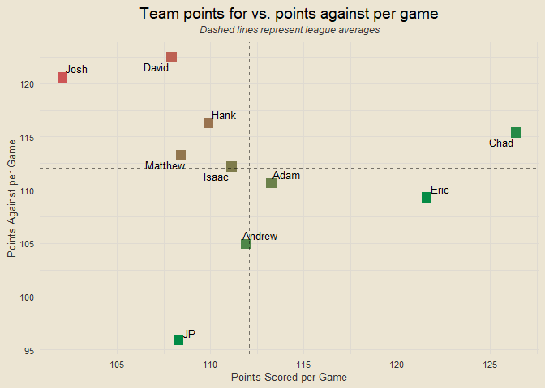

Travis Scott Burger Fantasy League 2025
================

### Contents

- [Team Standings](#team-standings)
- [Points Scored Per Game](#points-scored-per-game)
- [Points Against Per Game](#points-against-per-game)
- [Scatterplot of Points Scored and
  Against](#scatterplot-of-points-scored-and-against)
- [Optimal Lineup Setting](#optimal-lineup-setting)
- [Season-Long Optimal Lineups](#season-long-optimal-lineups)
- [Most Points Scored in a Loss](#most-points-scored-in-a-loss)
- [Fewest Points Scored in a
  Victory](#fewest-points-scored-in-a-victory)
- [Weekly Scoring Trends](#weekly-scoring-trends)
- [Close Games](#close-games)
- [Highest Scoring Games](#highest-scoring-games)
- [Biggest Blowouts](#biggest-blowouts)
- [Closest Games](#closest-games)
- [Most Points Scored by One Team](#most-points-scored-by-one-team)
- [Fewest Points Scored by One Team](#fewest-points-scored-by-one-team)
- [Past Week One Player Merchants](#past-week-one-player-merchants)
- [Luckiest Teams This Past Week](#luckiest-teams-this-past-week)
- [Luckiest Teams Season Long](#luckiest-teams-season-long)
- [Past Week Full Luck](#past-week-full-luck)
- [Season Long Full Luck](#season-long-full-luck)
- [Chug Analysis](#chug-analysis)

------------------------------------------------------------------------

### Team Standings

<!-- -->

------------------------------------------------------------------------

### Points Scored Per Game

<!-- -->

------------------------------------------------------------------------

### Points Against Per Game

<!-- -->

------------------------------------------------------------------------

### Scatterplot of Points Scored and Against

<!-- -->

------------------------------------------------------------------------

### Optimal Lineup Setting

<!-- -->

------------------------------------------------------------------------

### Season-Long Optimal Lineups

<!-- -->

------------------------------------------------------------------------

### Most Points Scored in a Loss

- Week 3: JP def. Adam 136.12-122.98
- Week 6: David def. Hank 143.83-120.26
- Week 4: JP def. Drew 162.54-118.23
- Week 4: Matt def. Jerry 125.14-117.69
- Week 1: Jerry def. Josh 135.88-115.53

------------------------------------------------------------------------

### Fewest Points Scored in a Victory

- Week 4: Adam def. Eric 72.44-70.28
- Week 1: Eric def. Drew 91.4-68.57
- Week 7: Chad def. Eric 91.6-62.88
- Week 6: Jerry def. Eric 97.64-62.4
- Week 3: Matt def. David 97.73-93.26

------------------------------------------------------------------------

### Weekly Scoring Trends

<!-- -->

------------------------------------------------------------------------

### Close Games

<!-- -->

------------------------------------------------------------------------

### Highest Scoring Games

- Week 4: JP def. Drew 162.54 to 118.23
- Week 5: Adam def. David 165.1 to 111.25
- Week 6: David def. Hank 143.83 to 120.26
- Week 3: JP def. Adam 136.12 to 122.98
- Week 7: Jerry def. JP 148.92 to 107.76

------------------------------------------------------------------------

### Biggest Blowouts

- Week 5: Hank def. Drew 143.83 to 80.98
- Week 6: Chad def. Drew 137.75 to 76.64
- Week 2: Josh def. Eric 137.81 to 82.82
- Week 5: Adam def. David 165.1 to 111.25
- Week 6: Adam def. Matt 142.83 to 91.58

------------------------------------------------------------------------

### Closest Games

- Week 3: Eric def. Hank 98.13 to 98.11
- Week 4: Adam def. Eric 72.44 to 70.28
- Week 3: Drew def. Jerry 103.08 to 99.47
- Week 3: Matt def. David 97.73 to 93.26
- Week 4: Chad def. Hank 107.04 to 102.47

------------------------------------------------------------------------

### Most Points Scored by One Team

- 165.1 (Adam, Week 5)
- 162.54 (JP, Week 4)
- 148.92 (Jerry, Week 7)
- 143.83 (David, Week 6)
- 143.83 (Hank, Week 5)

------------------------------------------------------------------------

### Fewest Points Scored by One Team

- 62.4 (Eric, Week 6)
- 62.88 (Eric, Week 7)
- 68.57 (Drew, Week 1)
- 70.28 (Eric, Week 4)
- 72.44 (Adam, Week 4)

------------------------------------------------------------------------

### Past Week One Player Merchants

- Jahmyr Gibbs: 27.8% of total points for JP
- Russell Wilson: 27.1% of total points for Drew
- Brock Bowers: 27% of total points for Eric
- Derrick Henry: 22.9% of total points for JP
- Lamar Jackson: 22.7% of total points for Adam

------------------------------------------------------------------------

### Luckiest Teams This Past Week

<!-- -->

------------------------------------------------------------------------

### Luckiest Teams Season Long

<!-- -->

------------------------------------------------------------------------

### Past Week Full Luck

<!-- -->

------------------------------------------------------------------------

### Season Long Full Luck

<!-- -->

------------------------------------------------------------------------

### Chug Analysis

<!-- -->
