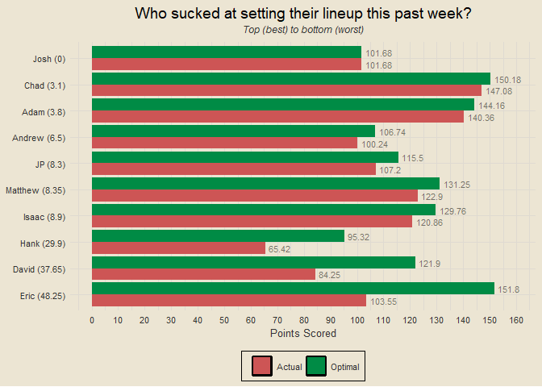
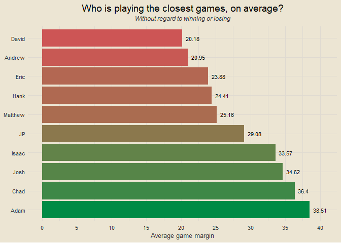
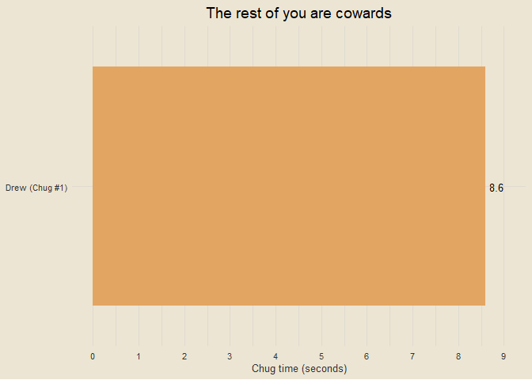

Travis Scott Burger Fantasy League 2025
================

### Contents

- [Team Standings](#team-standings)
- [Points Scored per Game](#points-scored-per-game)
- [Points Against per Game](#points-against-per-game)
- [Points Scored and Against](#points-scored-and-against)
- [Optimal Lineup Setting](#optimal-lineup-setting)
- [Season Long Optimal Lineups](#season-long-optimal-lineups)
- [Most Points Scored in a Loss](#most-points-scored-in-a-loss)
- [Fewest Points Scored in a
  Victory](#fewest-points-scored-in-a-victory)
- [Weekly Scoring Trends](#weekly-scoring-trends)
- [Close Games](#close-games)
- [Highest Scoring Games](#highest-scoring-games)
- [Biggest Blowouts](#biggest-blowouts)
- [Closest Games](#closest-games)
- [Most Points Scored by One Team](#most-points-scored-by-one-team)
- [Fewest Points Scored by One Team](#fewest-points-scored-by-one-team)
- [Past Week One Player Merchants](#past-week-one-player-merchants)
- [Full Season One Player Merchants](#full-season-one-player-merchants)
- [Luckiest Teams This Past Week](#luckiest-teams-this-past-week)
- [Luckiest Teams Season Long](#luckiest-teams-season-long)
- [Self Luck and Opponent Luck](#self-luck-and-opponent-luck)
- [Average Weekly Finishing
  Position](#average-weekly-finishing-position)
- [Chug Analysis](#chug-analysis)
- [Win Percentage by Strength of
  Schedule](#win-percentage-by-strength-of-schedule)
- [League Wide Optimal Scoring](#league-wide-optimal-scoring)

------------------------------------------------------------------------

### Team Standings

<!-- -->

------------------------------------------------------------------------

### Points Scored per Game

<!-- -->

------------------------------------------------------------------------

### Points Against per Game

<!-- -->

------------------------------------------------------------------------

### Points Scored and Against

<!-- -->

------------------------------------------------------------------------

### Optimal Lineup Setting

<!-- -->

------------------------------------------------------------------------

### Season Long Optimal Lineups

<!-- -->

------------------------------------------------------------------------

### Most Points Scored in a Loss

- Week 9: Josh def. Jeremiah 132.51-132.24
- Week 3: JP def. Adam 136.12-122.98
- Week 8: Chad def. JP 136.84-122.03
- Week 8: Jeremiah def. Adam 131.87-121.79
- Week 6: David def. Hank 143.83-120.26

------------------------------------------------------------------------

### Fewest Points Scored in a Victory

- Week 4: Adam def. Eric 72.44-70.28
- Week 8: Andrew def. Matthew 90.23-82.87
- Week 1: Eric def. Andrew 91.4-68.57
- Week 7: Chad def. Eric 91.6-62.28
- Week 6: Jeremiah def. Eric 97.64-62.4

------------------------------------------------------------------------

### Weekly Scoring Trends

<!-- -->

------------------------------------------------------------------------

### Close Games

<!-- -->

------------------------------------------------------------------------

### Highest Scoring Games

- Week 4: JP def. Andrew 162.54-118.23
- Week 5: Adam def. David 165.1-111.25
- Week 9: Josh def. Jeremiah 132.51-132.24
- Week 6: David def. Hank 143.83-120.26
- Week 3: JP def. Adam 136.12-122.98

------------------------------------------------------------------------

### Biggest Blowouts

- Week 5: Hank def. Andrew 143.83-80.98
- Week 6: Chad def. Andrew 137.75-76.64
- Week 2: Josh def. Eric 137.81-82.82
- Week 5: Adam def. David 165.1-111.25
- Week 6: Adam def. Matthew 142.83-91.58

------------------------------------------------------------------------

### Closest Games

- Week 3: Eric def. Hank 98.13-98.11
- Week 9: Josh def. Jeremiah 132.51-132.24
- Week 9: JP def. Andrew 108.65-108.25
- Week 9: Eric def. Matthew 98.07-96.36
- Week 4: Adam def. Eric 72.44-70.28

------------------------------------------------------------------------

### Most Points Scored by One Team

- 165.1 (Adam, Week 5)
- 162.54 (JP, Week 4)
- 148.92 (Jeremiah, Week 7)
- 148.33 (Adam, Week 9)
- 147.4 (Hank, Week 8)

------------------------------------------------------------------------

### Fewest Points Scored by One Team

- 62.28 (Eric, Week 7)
- 62.4 (Eric, Week 6)
- 68.57 (Andrew, Week 1)
- 70.28 (Eric, Week 4)
- 72.44 (Adam, Week 4)

------------------------------------------------------------------------

### Past Week One Player Merchants

- Jalen Hurts: 26.3% of total points for Hank
- De’Von Achane: 26% of total points for Andrew
- J.K. Dobbins: 24.4% of total points for Matthew
- Derrick Henry: 23.7% of total points for JP
- Saquon Barkley: 23.7% of total points for Jeremiah

------------------------------------------------------------------------

### Full Season One Player Merchants

- Lamar Jackson: 18.05% of total points for Adam
- Derrick Henry: 17.64% of total points for JP
- Baker Mayfield: 16.51% of total points for Jeremiah
- James Cook: 16.04% of total points for Eric
- Saquon Barkley: 15.45% of total points for Jeremiah

------------------------------------------------------------------------

### Luckiest Teams This Past Week

<!-- -->

------------------------------------------------------------------------

### Luckiest Teams Season Long

<!-- -->

------------------------------------------------------------------------

### Self Luck and Opponent Luck

<!-- -->

------------------------------------------------------------------------

### Average Weekly Finishing Position

<!-- -->

For example: if Hank had the best score in the league, the third best
score in the league, and the second best score in the league through
three weeks, his average weekly finishing position would be (1 + 3 + 2)
/ 3 = 2. Closely related to points per game, but not the exact same.

------------------------------------------------------------------------

### Chug Analysis

<!-- -->

------------------------------------------------------------------------

### Win Percentage by Strength of Schedule

<!-- -->

------------------------------------------------------------------------

### League Wide Optimal Scoring

<!-- -->

------------------------------------------------------------------------
